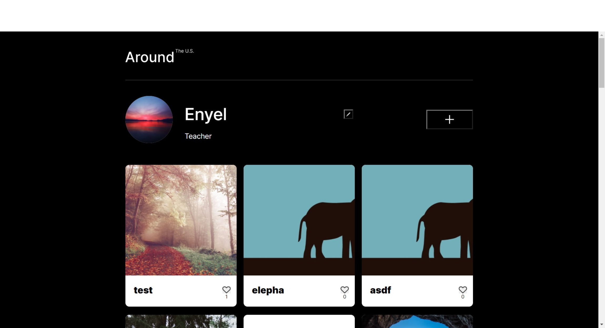
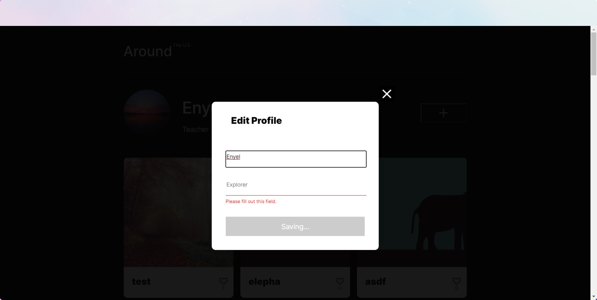
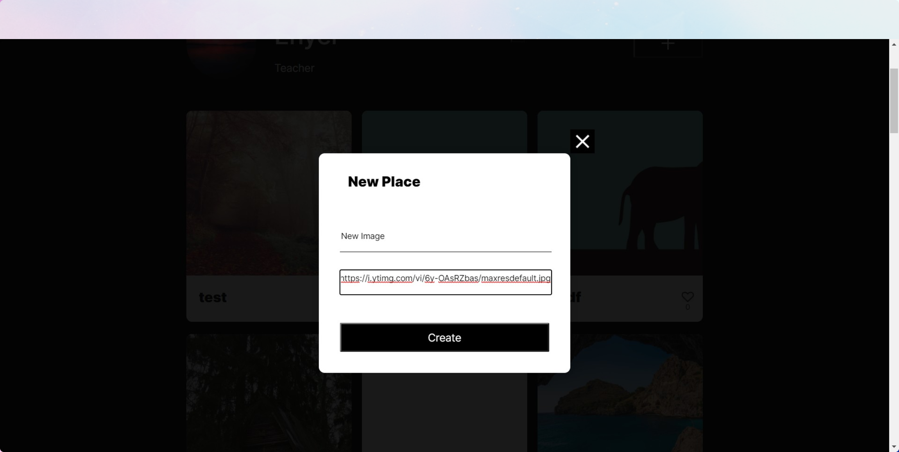
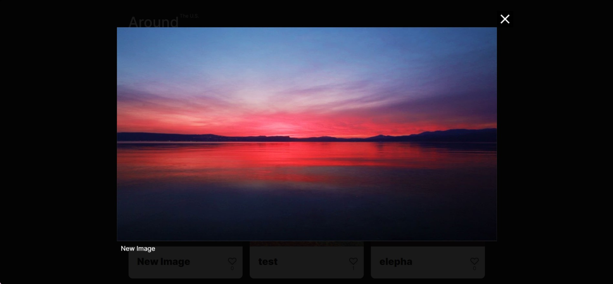

# Project: Social App 

## view only desktop. Still in process as a full-stack

### Overview
* This Project is a vanilla javascript app. The entire code base is done using Javascript classes and the app has a few functionalities described below. 
* This app uses an external Api which mean that other users can add images and like the images
* This app will consist of 3 different modals they will open accordingly one for editing the profile, one for adding an image to the DOM and one to display a bigger version of the image
* This app uses an external Api, you will need a key to use it, with this key you can manipulate what you can do in the app. Ex: The trash button will only show if the cards belong to you as a the user, you will not be able to delete other users cards 

### Functionality

* The app allows the user to change information, and add a new user avatar
* Allows users to add, delete, like. The user can only delete his own cards
* This app also allows client side authentication to correctly input the required fields. 
* It uses the fetch Api to get data accordingly.

### Images

### Technologies
* The Technologies being used in this app are: 
  * HTML, CSS
  * JavaScript Classes
  * Fetch
  * Webpack
  * Babel
 

### LINK
[Click here to see live Version --> ](enyelsequeira.github.io/social-app)

